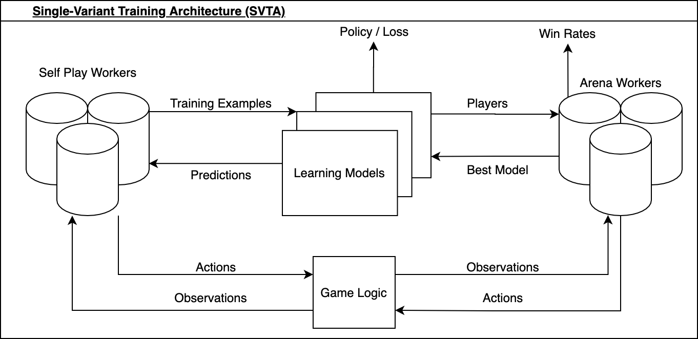
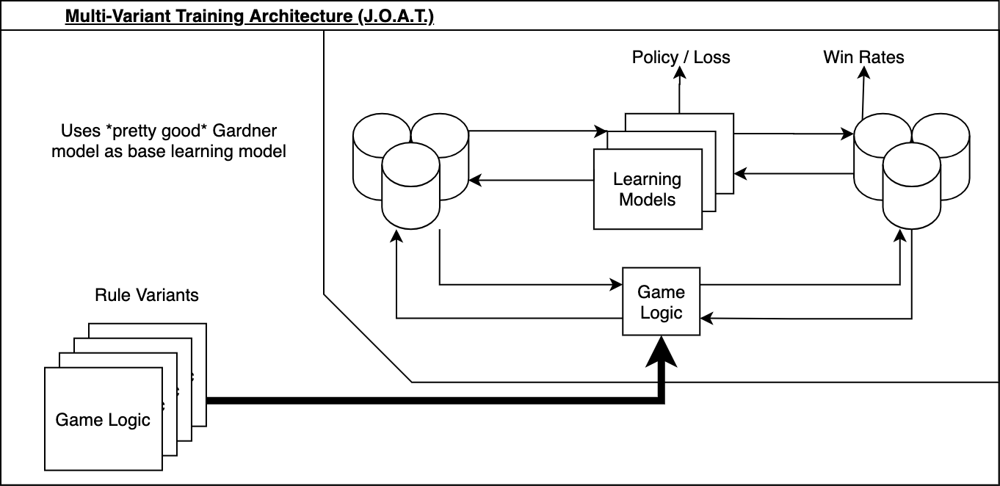
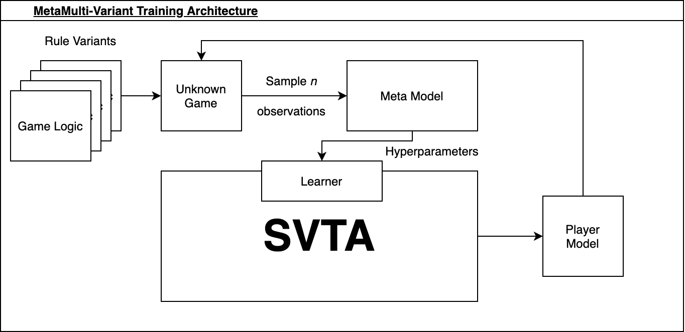

# meta-minichess

An environment to run meta-learning experiments on minichess games with varying rulesets. Class project for MIT's [6.883: Meta Learning](http://www.mit.edu/~idrori/metalearningmitfall2020.html).

See also: [minichess](https://github.com/mdhiebert/minichess) and [gym-minichess](https://github.com/mdhiebert/gym-minichess).

## Contents

- [Contents](#contents)
- [Quickstart](#quickstart)
  - [GCloud](#gcloud)
- [Scripts](#scripts)
  - [Train](#train)
  - [Test](#test)
- [Objective](#objective)
- [Methodology](#methodology)
- [Environment](#environment)
  - [Variants](#variants)
  - [minichess](#minichess)
  - [gym-minichess](#gym-minichess)
  - [Action Space](#action-space)
    - [Legality](#legality)
  - [Learning](#learning)
    - [Single-Variant Training Architecture](#single-variant-training-architecture)
    - [Multi-Variant Training Architecture](#multi-variant-training-architecture)
    - [MetaFocus Training Architecture](#metafocus-training-architecture)
  - [MCTS](#mcts)
- [Result Log](#result-log)
- [Changelog](#changelog)
- [References](#references)
- [Appendix](#appendix)
  - [MCTS Pseudocode](#mcts-pseudocode)

## Quickstart

Clone the repository:

```bash
git clone https://github.com/mdhiebert/meta-minichess.git
cd meta-minichess
```

Create conda environment:

```bash
conda env create -f environment.yml
conda activate mmc
```

**NOTE: all scripts have been tested far more extensively with distributed than undistributed processes. mileage may vary if `--workers` is left at default. undistributed is a WIP.**

Launch experiment to train a jack-of-all-trades minichess model with distributed computing:

```bash
python -m scripts.train --workers=6 --games gardner mallet baby rifle dark atomic --eval_on_baselines --arenapergame=0
```

To use more workers, simply bump up the `--workers` value.

See progress in terminal and updated loss plots in `./policy_loss.png` and `./value_loss.png`.

To conduct testing on the JOAT model's ability to adapt to a specific game variant:

```bash
python -m scripts.meta_test --loading_path pretrained_models/pytorch/meta15.pth.tar --workers=6 --eval_on_baselines --games gardner atomic mallet baby dark rifle
```

## GCloud

Spin up a VM instance via Google Cloud Compute Engine

- May run into specifications and limits based upon numbers of vCPUs wanted and region/zone of hosting

Download [Google Cloud SDK](https://cloud.google.com/sdk/docs/quickstart) Locally

[Upload files to VM via SCP](https://cloud.google.com/compute/docs/instances/transfer-files#transfergcloud)

```bash
gcloud compute scp --recurse meta-minichess/ instance-name:~
```

[Download and Install Anaconda](https://medium.com/google-cloud/set-up-anaconda-under-google-cloud-vm-on-windows-f71fc1064bd7)

First, SSH into the VM

```bash
gcloud compute ssh instance-name
```

Once in, install basic tools, download the latest Anaconda distribution, execute the shell script, and then reset the bash commands.

```instance bash
sudo apt-get update
sudo apt-get install bzip2 libxml2-dev
sudo apt-get install wget
wget https://repo.anaconda.com/archive/Anaconda3-2020.11-Linux-x86_64.sh
bash Anaconda3-2020.11-Linux-x86_64.sh
rm Anaconda3-2020.11-Linux-x86_64.sh
source .bashrc
```

Now, it's ready to follow Quickstart Guide above!

## Scripts

### Train

For more details on training, refer to the help:

```bash
$ python -m scripts.train --help
usage: train.py [-h] [--iterations ITERATIONS] [--episodes EPISODES]
                [--mcts_sims MCTS_SIMS] [--arenapergame ARENAPERGAME]
                [--max_moves MAX_MOVES] [--win_threshold WIN_THRESHOLD]
                [--workers WORKERS]
                [--games {gardner,mallet,baby,rifle,dark,atomic} [{gardner,mallet,baby,rifle,dark,atomic} ...]]
                [--probs PROBS [PROBS ...]] [--eval_on_baselines] [--debug]

Train a multitasking minichess model.

optional arguments:
  -h, --help            show this help message and exit
  --iterations ITERATIONS
                        Number of full AlphaZero iterations to run for
                        training (default: 500)
  --episodes EPISODES   Number of episodes of self-play per iteration
                        (default: 100)
  --mcts_sims MCTS_SIMS
                        Number of MCTS simulations to perform per action.
  --arenapergame ARENAPERGAME
                        The number of Arena Games to conduct per game variant
                        per iteration. This number will be divided in half to
                        give the model equal reps as both black and white. If
                        this is 0, Arena will be skipped. (default: 10)
  --max_moves MAX_MOVES
                        The maximum number of moves permitted in a minichess
                        game before declaring a draw (default: 75)
  --win_threshold WIN_THRESHOLD
                        The win threshold above which a new model must reach
                        during arena-play to become the new best model
                        (default: 0.6)
  --workers WORKERS     The number of workers to use to process self- and
                        arena-play. A value >1 will leverage multiprocessing.
                        (default: 1)
  --games {gardner,mallet,baby,rifle,dark,atomic} [{gardner,mallet,baby,rifle,dark,atomic} ...]
                        The games to consider during training. (default: just
                        gardner)
  --probs PROBS [PROBS ...]
                        The probabilities of the games to consider during
                        training. The ith probability corresponds to the ith
                        game provided. If no value is provided, this defaults
                        to a uniform distribution across the provided games.
                        (default: uniform dist)
  --eval_on_baselines   If passed in, we will evaluate our model against
                        random and greedy players and plot the win rates.
  --debug

```

### Test

For more details on testing, refer to the help:

```bash
$ python -m scripts.meta_test --help
usage: meta_test.py [-h] [--loading_path LOADING_PATH] [--episodes EPISODES]
                    [--arenapergame ARENAPERGAME] [--max_moves MAX_MOVES]
                    [--workers WORKERS]
                    [--games {gardner,mallet,baby,rifle,dark,atomic} [{gardner,mallet,baby,rifle,dark,atomic} ...]]
                    [--learning_rate LEARNING_RATE] [--dropout DROPOUT]
                    [--epochs EPOCHS] [--batch_size BATCH_SIZE]
                    [--num_channels NUM_CHANNELS] [--eval_on_baselines]
                    [--use_cuda] [--dont_use_cuda] [--debug]

Test a JOAT minichess model via n-shot adaptation.

optional arguments:
  -h, --help            show this help message and exit
  --loading_path LOADING_PATH
                        Path to the JOAT model weights.
  --episodes EPISODES   Number of episodes of self-play for adaptation og JOAT
                        (default: 100)
  --arenapergame ARENAPERGAME
                        The number of Arena Games to conduct per game variant.
                        This number will be divided in half to give the model
                        equal reps as both black and white. If this is 0,
                        Arena will be skipped. (default: 10)
  --max_moves MAX_MOVES
                        The maximum number of moves permitted in a minichess
                        game before declaring a draw (default: 75)
  --workers WORKERS     The number of workers to use to process self- and
                        arena-play. A value >1 will leverage multiprocessing.
                        (default: 1)
  --games {gardner,mallet,baby,rifle,dark,atomic} [{gardner,mallet,baby,rifle,dark,atomic} ...]
                        The games to consider during testing. The adapted JOAT
                        model will be assessed for each variant. (default:
                        just gardner)
  --learning_rate LEARNING_RATE
                        The learning rate during adaptation.
  --dropout DROPOUT     Dropout rate during adaptation.
  --epochs EPOCHS       Number of epochs during adaptation.
  --batch_size BATCH_SIZE
                        Batch size during adaptation.
  --num_channels NUM_CHANNELS
                        Number of channels to use in the model during
                        adaptation.
  --eval_on_baselines   If passed in, we will evaluate our model against
                        random and greedy players and plot the win rates.
  --use_cuda            If passed, force the system to use CUDA. (default:
                        whether or not CUDA is available)
  --dont_use_cuda       Force the system NOT to use CUDA, even if its
                        available (default: False)
  --debug

```

## Pseudocode

Michael
1. AlphaZero working
	- Ability to ingest MetaModel or None
2. Implement Extinction
3. Create Skeleton for training

Rishi
1. Look into Cloud Compute & Parallelization
2. Figure out paper off of MetaModel

Tag team skeleton and launch train.py


1. Look into prebuilt AlphaZero (Michael)
2. Look into Cloud Compute and parallelizing selfplay / arena play (Rishi)
3. implement 1 more env (Michael)
4. Meta Model (Rishi)
5. model (Michael)

### Testing

```


## TRAINING
model = Model()
for n in NUM_ITERS: # 1000
	sample g from [atomic, gardner, dark, rifle, extinction]:
		run a full alphazero iteration on g with model

## TESTING
100x:
sample g from [variations]: (same weight)
	JOAT play random
	JOAT play greedy
	plot / log both of the results
we will be satisfied if JOAT wins above some threshold of these games, 60%
JOAT vs random, greedy 20 times given some game state

## META TRAINING
metamodel = MetaModel() # controls dropout

JOAT model (no grad)

Nx:
sample g from [varitions]: (uniform)
	meta = [JOAT + Dropout](https://stackoverflow.com/questions/41583540/custom-dropout-in-tensorflow)
	JOAT x meta: same alphazero iteration. 

	MetaModel:
		outputprobs = [] # differentiable

		r = random.rand()

		binary_str = 0111000, outputprobs

		USE binary_str, calculate backprop with outputprobs
```

## Eval Metrics

Originally:

Have a fixed model, and a model trained on oneshot, pit against each other, show that win rate is >50%

Now:

JOAT Model #1 - do not apply metamodel, no dropout
JOAT Model #2 - we do apply

JOAT1 vs JOAT2, evaluate wins

JOAT1 and JOAT2 vs random, greedy, etc. show superiority

## Objective

In practical application, one of the most compelling aspects of human intelligence is its adaptability. With strategy games, like chess (or its smaller variant, minichess), the value of this aspect shines most brightly in situations where rules are not static from game to game. In chess, these dynamic conditions manifest themselves as [variants of standard play](https://en.wikipedia.org/wiki/List_of_chess_variants). In real life, they may manifest themselves as changing weather or terrain conditions, or other unforeseen and sudden human/machine limitations.
 
State of the art reinforcement learning models are able to achieve superhuman performance under static conditions. [AlphaZero](https://arxiv.org/pdf/1712.01815.pdf), and its successor, [MuZero](https://arxiv.org/pdf/1911.08265.pdf), have attained practically-perfect levels of skill in games like Chess, Shogi, and Go. This performance quickly deteriorates when the rules they were trained under are altered. An AlphaZero model exhibiting perfect play in [Gardner minichess](https://en.wikipedia.org/wiki/Minichess#5%C3%975_chess), say, loses TODO% of its games against a random player in variants of the game like [Atomic chess](https://en.wikipedia.org/wiki/Atomic_chess).
 
To this end, we seek to create a meta-learning framework around a modified [implementation of AlphaZero](https://github.com/suragnair/alpha-zero-general) in order to train a meta-model which can identify changing conditions and provide a learning model which can quickly (≤1 AlphaZero iteration) adapt to and excel under them.

## Methodology

### Environment
 
Much of the initial effort was spent creating an environment to facilitate our minichess meta/reinforcement learning experiments. There were no pre-existing libraries that supported the rule variants of minichess, so we created our own.

#### Variants
 
We set out to implement several different variants of standard [Gardner minichess](https://en.wikipedia.org/wiki/Minichess#5%C3%975_chess):
 
- [Baby Chess](https://en.wikipedia.org/wiki/Minichess#5%C3%975_chess) - a variant with the same rules, but a different starting configuration.
- [Mallet Chess](https://en.wikipedia.org/wiki/Minichess#5%C3%975_chess) - another variant with the same rules, but a different starting configuration.
- [Rifle Chess](https://www.chessvariants.com/difftaking.dir/rifle.html) - standard starting configuration, but captures happen "at range", where the capturing piece does not occupy the tile of the captured piece
- [Atomic Chess](https://en.wikipedia.org/wiki/Atomic_chess) - standard starting configuration, but captures also remove the capturing piece and all non-pawn pieces surrounding the captured piece
- [Monochromatic Chess](https://en.wikipedia.org/wiki/Monochromatic_chess) - standard starting configuration, but pieces can only move to tiles that share the color of the tile they started on
- [Bichromatic Chess](https://en.wikipedia.org/wiki/Monochromatic_chess#Bichromatic_chess) - standard starting configuration, but pieces can only move to tiles that have the opposite color of their current tile
- [Dark Chess](https://en.wikipedia.org/wiki/Dark_chess) - standard starting configuration, but a player can only see their own pieces and tiles that their pieces can move to, the rest remain "dark"
- [Extinction Chess](https://en.wikipedia.org/wiki/Extinction_chess) - standard starting configuration but the victory conditions are changed, the first player to remove all of any one kind of piece from their opponent (e.g. capturing the king, or both rooks, all pawns) wins.

#### minichess
 
The first repository, [minichess](https://github.com/mdhiebert/minichess), was created to handle the game logic of our base ruleset, Gardner's Minichess, and several others. We implemented Gardner, Baby, Mallet, Dark, Rifle, Atomic, Monochromatic, and Bichromatic.
 
Wrappers for these are implemented in `./games`. The wrapper for gardner, baby, and mallet were borrowed (with slight modification) from [Karthik Selva's fork of alpha-zero-general](https://github.com/karthikselva/alpha-zero-general).
 
#### gym-minichess
 
We also created an OpenAI gym environment for minichess, found at [gym-minichess](https://github.com/mdhiebert/gym-minichess).
 
Work on this was halted as we pivoted towards experiments not relying on the gym substructure.

### Action Space

For our RL model, we have chosen to represent our action space as a (1225,) vector. This is because we have:

- 5 x 5 = 25 possible tiles to choose from when selecting a piece
- 8 directions to move it in, maximum magnitude 4 to move from initial position along that direction
- additional 8 possible knight moves
- 3 underpromotions (knight, bishop, rook), with 3 moves to result in an underpromotion (left-diag capture, forward, right-diag capture).

This gives us 5x5x(8x4 + 8 + 3x3) = 1225 possible actions to choose from.

#### Legality

Of course. Not all moves are valid at every step. To account for this, we simply apply a mask over illegal moves to our networks output and re-normalize.

### Learning
 
The first step was to train an expert-level Gardner minichess model to serve as the base of future adaptable models. The intuition was that since it had mastered the standard ruleset, its understanding of the innate mechanisms of minichess would enable it to learn other rulesets more quickly than from scratch.
 
As such, we relied on the `alpha-zero-general` implementation of AlphaZero mentioned above to serve as our inner loop for AlphaZero iterations. *However*, at the time of this project, the repository did not support distributed computation, resulting in extremely slow training. To remedy this, we modified the pipeline to allow for multiprocessing. This modified system can be found in `learning/alpha_zero/distributed`.
 
We thus had the following training architecture for learning on single variants:
 
#### Single-Variant Training Architecture
 

 
TODO
 
#### Multi-Variant Training Architecture
 

 
Our meta-training architecture for multiple variants is very similar to [MAML for RL](https://arxiv.org/pdf/1703.03400.pdf), and was inspired by a project done for [MIT's 6.882](https://phillipi.github.io/6.882/2019/) in Spring of 2019: [INSECT](https://echen9898.github.io/assets/2019-05-18/882_Report.pdf). The double gradient loop of MAML requires many self-play iterations, which prove to be the most costly portion of the training loop. By removing the second gradient loop and instead taking an average over the policies found in the inner loop, we cut down on a significant amount of training time. In exposing our model to our distribution of tasks by sampling a rule-variant and running it through our SVTA, we aim to produce a Jack-of-All-Trades (JOAT) model that can quickly adapt to different variants.
 
In pseudocode:
 
```python
policy = random_init_policy()
 
while not done:
 
tasks = sample(task_distribution)
 
policies_prime = []
 
for task in tasks:
loss = 0
for _ in range(K):
loss += mcts_iteration(policy)
 
policy_prime = policy - (alpha * gradient(loss))
 
policies_prime.append(policy_prime)
 
policy = average(policies_prime)
 
return policy
```
 
This implementation can be found at `JOATCoach.metatrain()` in `learning/alpha_zero/distributed/joat_coach.py`
 
The results of our metatraining can be seen in [results](#results).
 
In addition, we also tried to tackle this problem from a different angle, using [controlled dropout](https://github.com/kobiso/Controlled-Dropout) to improve performance across varying rulesets:
 
#### MetaFocus Training Architecture
 

 
TODO

## Result Log
 
### Model vs Random (Atomic)
```
♜ ♞ ♝ ♛ ♚
♟ ♟ ♟ ♟ ♟
⊙ ⊙ ⊙ ⊙ ⊙
♙ ♙ ♙ ♙ ♙
♖ ♘ ♗ ♕ ♔
 
♜ ♞ ♝ ♛ ♚
♟ ♟ ♟ ♟ ♟
⊙ ⊙ ⊙ ⊙ ♙
♙ ♙ ♙ ♙ ⊙
♖ ♘ ♗ ♕ ♔
 
♜ ♞ ♝ ♛ ♚
♟ ♟ ⊙ ♟ ♟
⊙ ⊙ ♟ ⊙ ♙
♙ ♙ ♙ ♙ ⊙
♖ ♘ ♗ ♕ ♔
 
♜ ♞ ♝ ♛ ♚
♟ ♟ ⊙ ♟ ♟
⊙ ⊙ ♟ ⊙ ♙
♙ ♙ ♙ ♙ ♕
♖ ♘ ♗ ⊙ ♔
 
♜ ♞ ♝ ⊙ ♚
♟ ♟ ⊙ ♟ ♟
⊙ ⊙ ♟ ⊙ ♙
⊙ ♙ ♙ ♙ ♕
⊙ ⊙ ♗ ⊙ ♔
 
♜ ♞ ⊙ ⊙ ⊙
♟ ♟ ⊙ ⊙ ♟
⊙ ⊙ ♟ ⊙ ⊙
⊙ ♙ ♙ ♙ ♕
⊙ ⊙ ♗ ⊙ ♔
 
WHITE WIN
```

### Greedy Winning Move (Gardner)

This move sequence stumps models in the early stages of training.
```
♜ ♞ ♝ ♛ ♚
♟ ♟ ♟ ♟ ♟
⊙ ⊙ ⊙ ⊙ ⊙
♙ ♙ ♙ ♙ ♙
♖ ♘ ♗ ♕ ♔

♜ ♞ ♝ ♛ ♚
♟ ♟ ♟ ♟ ♟
⊙ ♙ ⊙ ⊙ ⊙
♙ ⊙ ♙ ♙ ♙
♖ ♘ ♗ ♕ ♔

♜ ♞ ♝ ♛ ♚
♟ ♟ ♟ ♟ ⊙
⊙ ♙ ⊙ ⊙ ♟
♙ ⊙ ♙ ♙ ♙
♖ ♘ ♗ ♕ ♔

♜ ♞ ♝ ♛ ♚
♟ ♟ ♙ ♟ ⊙
⊙ ⊙ ⊙ ⊙ ♟
♙ ⊙ ♙ ♙ ♙
♖ ♘ ♗ ♕ ♔

♜ ♞ ♝ ♛ ♚
♟ ♟ ♙ ♟ ⊙
⊙ ⊙ ⊙ ⊙ ⊙
♙ ⊙ ♙ ♟ ♙
♖ ♘ ♗ ♕ ♔

♜ ♞ ♝ ♙ ♚
♟ ♟ ⊙ ♟ ⊙
⊙ ⊙ ⊙ ⊙ ⊙
♙ ⊙ ♙ ♟ ♙
♖ ♘ ♗ ♕ ♔

♜ ♞ ♝ ♙ ♚
♟ ♟ ⊙ ♟ ⊙
⊙ ⊙ ⊙ ⊙ ⊙
♙ ⊙ ♙ ⊙ ♙
♖ ♘ ♗ ♕ ♟

BLACK WIN
```

At iteration ~15 it is replaced with the following sequence:
```
♜ ♞ ♝ ♛ ♚
♟ ♟ ♟ ♟ ♟
⊙ ⊙ ⊙ ⊙ ⊙
♙ ♙ ♙ ♙ ♙
♖ ♘ ♗ ♕ ♔

♜ ♞ ♝ ♛ ♚
♟ ♟ ♟ ♟ ♟
⊙ ⊙ ⊙ ♙ ⊙
♙ ♙ ♙ ⊙ ♙
♖ ♘ ♗ ♕ ♔

♜ ♞ ♝ ♛ ♚
♟ ♟ ♟ ♟ ⊙
⊙ ⊙ ⊙ ♟ ⊙
♙ ♙ ♙ ⊙ ♙
♖ ♘ ♗ ♕ ♔

♜ ♞ ♝ ♛ ♚
♟ ♟ ♟ ♟ ⊙
⊙ ⊙ ⊙ ♙ ⊙
♙ ♙ ♙ ⊙ ⊙
♖ ♘ ♗ ♕ ♔

♜ ♞ ♝ ♛ ♚
♟ ♟ ⊙ ♟ ⊙
⊙ ⊙ ⊙ ♟ ⊙
♙ ♙ ♙ ⊙ ⊙
♖ ♘ ♗ ♕ ♔

♜ ♞ ♝ ♛ ♚
♟ ♟ ⊙ ♟ ⊙
⊙ ⊙ ⊙ ♙ ⊙
♙ ♙ ⊙ ⊙ ⊙
♖ ♘ ♗ ♕ ♔

♜ ♞ ♝ ⊙ ♚
♟ ♟ ⊙ ♟ ⊙
⊙ ⊙ ⊙ ♙ ⊙
♛ ♙ ⊙ ⊙ ⊙
♖ ♘ ♗ ♕ ♔

♜ ♞ ♝ ⊙ ♚
♟ ♟ ⊙ ♟ ⊙
⊙ ⊙ ⊙ ♙ ⊙
♛ ♙ ⊙ ⊙ ♕
♖ ♘ ♗ ⊙ ♔

♜ ♞ ♝ ⊙ ♚
♟ ♟ ⊙ ♟ ⊙
⊙ ⊙ ⊙ ♙ ⊙
⊙ ♙ ⊙ ⊙ ♕
♛ ♘ ♗ ⊙ ♔

♜ ♞ ♝ ⊙ ♕
♟ ♟ ⊙ ♟ ⊙
⊙ ⊙ ⊙ ♙ ⊙
⊙ ♙ ⊙ ⊙ ⊙
♛ ♘ ♗ ⊙ ♔

WHITE WIN
```

## Changelog

*[11/26]* Trained Gardner model and subsequent meta model. Took ~30 hours all-in-all. Gardner iterations take substantially more time only because of hyperparameters (20 episodes / meta-task vs 100 episodes / gardner-task). We will likely bump this up if results are not satisfactory.
 
*[11/25]* Bug fixes and more training. Created diagrams and added significant information to the README.
 
Implemented new JOAT training loop based on MAML/INSECT.

*[11/24]* Added `scripts/train.py` to facilitate training. Added ability to bypass Arena play and evaluate against random/greedy benchmarks. Modified all games to produce greedy/random players for evaluation.

*[11/23]* Implemented distributed self-play and arena-play.

*[11/22]* JOAT Infrastructure and Dark/Monochromatic/Bichromatic implementations done.

*[11/18]* Implemented Atomic Chess rule variant.

*[11/15]* Updated `scripts/mcts_sim.py` to support command line arguments to set game.

*[11/14]* Wrote `scripts/mcts_sim.py` to facilitate MCTS simulations.

*[11/12]* Wrote `scripts/refresh.py` to facilitate setup and make development a little easier.

*[11/10]* Implemented Dark Chess rule variant.

*[11/09]* Implemented Rifle Chess rule variant.

*[11/07]* Refactor complete. gym-minichess initial implementation is also complete. Able to run a forked version of [muzero-pytorch](https://github.com/mdhiebert/muzero-pytorch) for out-of-the-box environment. Working on connecting existing environments with MuZero codebase. Seems to have an error running on Windows - will confirm.

Error confirmed for Windows, even with running out-of-box experiments.

*[11/04]* Beginning the refactor. Pushed initital code for [gym-minichess](https://github.com/mdhiebert/gym-minichess). Will do this "bottom-up", starting with MiniChess implementation and build up.

*[11/03]* Decided to create an OpenAI Gym environment to facilitate our RL. Will hopefully be easy to hook it up to a MuZero implementation. We can create several sub-environments within our Gym to handle the variations across rules. Will require a refactor.

*[10/30]* Model able to train, improve, and then achieve ideal end-states (victory vs naive opponents, draw vs. itself) using MCTS and conventional neural network.

## References

- Learning to Play Minichess Without Human Knowledge - K. Bhuvaneswaran ([paper](https://cs230.stanford.edu/projects_spring_2018/reports/8290438.pdf)) ([code](https://github.com/karthikselva/alpha-zero-general))
    - Very useful reference for training Minichess models, also has some pretrained Keras models.
- Learning to Cope with Adversarial Attacks - X. Lee, A. Heavens et al. ([paper](https://arxiv.org/pdf/1906.12061.pdf))
    - Adversarial RL Grid World algorithm
- Continuous Adaptation via Meta-Learning in Nonstationary and Competitive Environments - M. Al Shedivat, T. Bansal, et al. ([paper](https://arxiv.org/pdf/1710.03641.pdf)) ([code](https://github.com/openai/robosumo))
	- 'Spider' paper
	- Similar meta-model & outer-loop structure
- Model-Agnostic Meta-Learning for Fast Adaptation of Deep Networks - C. Finn, P. Abbeel & S. Levine ([paper](https://arxiv.org/pdf/1703.03400.pdf)) ([code](https://github.com/cbfinn/maml))
	- Meta-Learning Architecture
	- Created MAML for Few-Shot Supervised Learning as basline
- Meta-World: A Benchmark and Evaluation for Multi-Task and Meta Reinforcement Learning - T. Yu, D. Quillen et al. ([paper](https://arxiv.org/pdf/1910.10897v1.pdf))
	- Defined 'Meta-World' as task distribution
	- Utilize as model to define task/rules distribution of different chess piece rule sets

## Appendix
 
### MCTS Pseudocode
 
Pseudocode base off of [alpha-zero-general](https://github.com/suragnair/alpha-zero-general/blob/master/MCTS.py) implementation.
```
game <- game()
net <- net()
 
Q_sa <- {} # stores Q values for s,a (as defined in the paper)
N_sa <- {} # stores #times edge s,a was visited
N_s <- {} # stores #times board s was visited
P_s <- {} # stores initial policy (returned by neural net)
E_s <- {} # stores game.getGameEnded ended for board s
V_s <- {} # stores game.getValidMoves for board s
 
board <- current board
 
for iteration in NUM_MCTS_ITERATIONS:
  search(board)
 
counts <- number of times each action was visited from state board
 
if temp = 0:
  bestAs <- actions with max count
  bestA <- sample(bestAs)
 
  return onehot of len(ACTION_SPACE) with idx bestA = 1
 
counts <- [x ** (1. / temp) for x in counts]
 
return counts / sum(counts) # probabilities
 
 
### SEARCH(board)
 
state <- board
 
if state not in E_s:
  E_s[state] <- status of game
 
if state.status != ONGOING:
  return -1 * (value of status)
 
if s not in P_s:
  P_s[s] <- net(board) # network prediction of board
  valid <- all current legal moves from state
  
  # mask invalid moves
  # renormalize
 
  if all moves were masked:
    P_s[s] <- (P_s[s] + valids) / P_s[s]
 
  V_s[s] <- valids
 
  # pick action with highest upper confidence bound
  for action in actions:
    if action is valid:
      if (s,a) in Q_sa:
        u <- Q_sa[sa] + CPUCT + P_s[s][action] * sqrt(N_s[s]) / (1 + N_sa[sa])
      else:
        u <- CPUCT * P_s[s][action] * sqrt(N_s[s] + eps)
 
  state <- apply best action to current state
 
  search(state)
 
  if (state, action) in Q_sa:
    Q_sa[(s, a)] <- (N_sa[(s, a)] * Q_sa[(s, a)] + v) / (N_sa[(s, a)] + 1)
    N_sa[(s, a)] <- N_sa[(s, a)] + 1
 
  else:
    Q_sa[(s,a)] <- v
    N_sa[(s,a)] <- 1
 
  N_s[s] <- N_s + 1
 
  return -v
 
```
